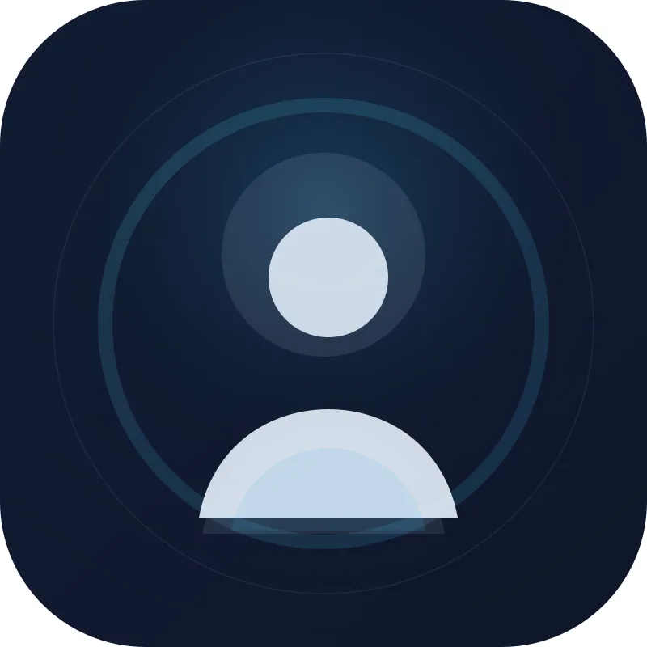
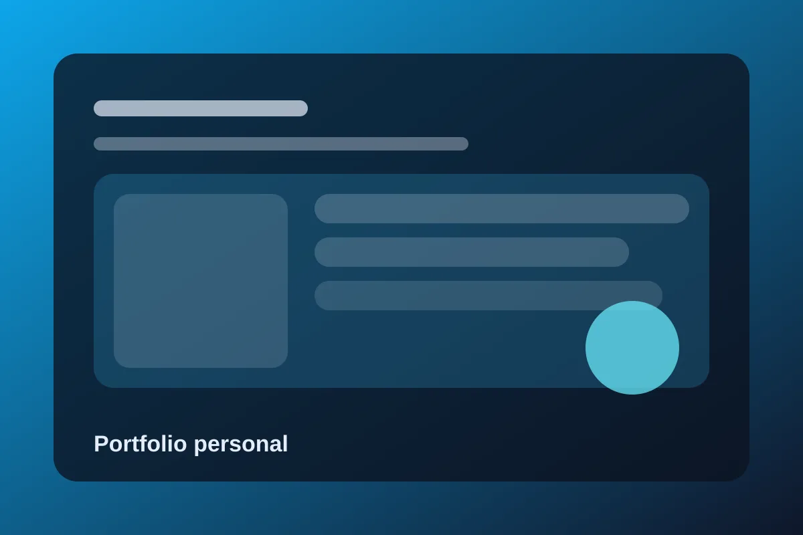

# Portfolio personal de Pablo Ruiz

Portfolio estático y accesible para presentar mi perfil profesional, proyectos, habilidades y formulario de contacto. Está desarrollado con HTML, CSS y JavaScript vanilla para mantener una estructura ligera, rápida y fácil de mantener.

## Tecnologías

- HTML5
- CSS3
- JavaScript vanilla
- SVG para iconos y marca
- Formspree-ready contact form
- Accesibilidad y optimización SEO básica

## Estructura del proyecto

```text
portfolio/
├── css/
│   └── styles.css
├── docs/
│   └── (documentación y recursos)
├── img/
│   ├── icons/
│   ├── favicon.svg
│   ├── profile.webp
│   ├── project-1.webp
│   ├── project-2.webp
│   └── project-3.webp
├── js/
│   ├── i18n.js
│   └── script.js
├── index.html
├── LICENSE
├── README.md
└── .github/
```

## Capturas





## Cómo ejecutarlo localmente

1. Clona este repositorio.
2. Abre la carpeta del proyecto en tu editor.
3. Ejecuta un servidor local, por ejemplo:

```bash
cd portfolio
python3 -m http.server 8000
```

4. Abre en tu navegador:

```text
http://localhost:8000
```

## Enlace publicado

<!-- TODO: Añadir la URL real del sitio publicado cuando esté desplegado -->

Pendiente de publicación real.

## Notas

- El contenido sigue una estrategia orientada a reclutadores y a oportunidades de trabajo junior/frontend.
- Los datos reales (CV, enlaces profesionales, endpoint de Formspree, URL de despliegue) deben actualizarse cuando estén disponibles.
- La estructura está pensada para facilitar mantenimiento y revisión rápida del código.

## Licencia

Este proyecto se distribuye bajo la licencia del repositorio. Consulta [LICENSE](LICENSE).
